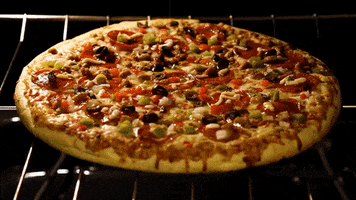
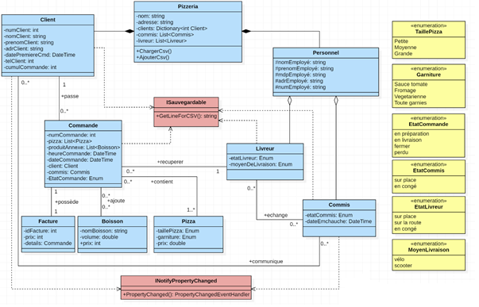
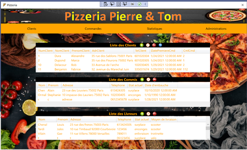

<h1 align="center">
  
</h1>

---

# LOGICIEL DE GESTION D’UNE PIZZERIA

## Petit résumé

- Plat emblématique de la culture italienne et de la restauration rapide dans le monde entier, la pizza est déclinée sous de multiples variantes.

- La livraison, quant à elle, séduit de plus en plus. La proportion des Français ayant recours à la livraison est ainsi passée de 40 à 46 % entre 2019 et 2020, séduisant à présent toutes les classes d'âge.

## Problème

- Nous avons informatisé le système de commande et livraison d’une pizzeria.

## Techno
- C#
- Visual Studio

## UML

## UI

## Auteur

- [@Pierre](https://github.com/Pierre-Portfolio)
- [@Tom](https://github.com/Flaye)