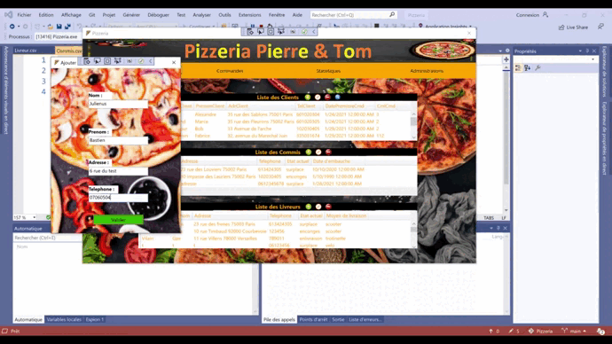

<h1 align="center">
  
</h1>

---

# LOGICIEL DE GESTION D’UNE PIZZERIA

## Petit résumé
Ce projet couvre deux aspects :

- Plat emblématique de la culture italienne et de la restauration rapide dans le monde entier, la pizza est déclinée sous de multiples variantes.

- La livraison à domicile ou sur le lieu de travail séduit de plus en plus. La proportion des Français ayant recours à celle-ci est ainsi passée de 40 à 46 % entre 2019 et 2020, séduisant toutes les classes d'âge.

## Objectif

- Intégrer dans un système unique la gestion et la livraison d’une pizza.

## Techno
- C#
- Visual Studio

## UML

## UI

## Auteur

- [@Pierre](https://github.com/Pierre-Portfolio)
- [@Tom](https://github.com/Flaye)
